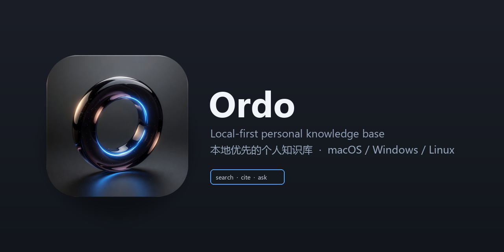

<p align="center">
  
</p>

<h1 align="center">Ordo</h1>

<p align="center">
  <a href="https://github.com/RexVane/Ordo/actions/workflows/backend-tests.yml"></a>
  <a href="LICENSE"></a>
  
</p>

Ordo 是本地优先的知识管理与严格证据问答产品。当前工程提供统一 Web 工作台和版本化 API，可在单机上完成数据导入、解析、知识块修订、不可变 Release、混合检索、引用问答、Wiki、助手、审计、备份与隔离恢复。

## 运行要求

- Windows、macOS 或 Linux
- Node.js 24 或更高版本（使用内置 `node:sqlite`）
- 首次安装需要访问 npm registry

## 安装与启动

```powershell
git clone https://github.com/RexVane/Ordo.git
cd Ordo
npm --prefix server install
npm run seed
npm start
```

打开 `http://127.0.0.1:8790/`。同一端口提供 Web 和 `/api/v1`，OpenAPI 3.1 契约位于 `http://127.0.0.1:8790/api/v1/openapi.json`。

`npm run seed` 会导入 [`server/fixtures/ordo-sample-knowledge.md`](./server/fixtures/ordo-sample-knowledge.md)，完成真实解析并构建活动 Release。命令可重复执行，内容哈希去重会避免重复文档和 Blob。

## 数据与安全

默认数据目录是 `.ordo-data/`，可通过 `ORDO_DATA_DIR` 指向其他受管位置。目录包含 SQLite 元数据、内容寻址 Blob、标准产物、任务状态、备份、运行密钥和日志。

- 管理 API 使用随机本机会话 HttpOnly Cookie，所有写请求还需要 CSRF 令牌。
- API Key 与数据库密码使用 AES-256-GCM 保存，业务记录和响应只保存 SecretRef 与掩码。
- 上传和归档导入执行格式白名单、MIME、路径穿越、链接、嵌套包和资源预算检查。
- SQLite/PostgreSQL 连接器只允许受控、参数化的只读查询模板。
- 网站助手使用 HMAC、短期令牌、Origin 绑定、nonce 防重放和独立速率限制。
- Release、块修订和 Wiki 修订不可变；审计事件形成可验证的追加哈希链。
- 恢复只写入新的空目录并完成完整性检查，不覆盖当前运行实例。

图片和扫描 PDF 在没有经过验证的 OCR/VLM Provider 时进入“需复核”，不会被伪装成解析成功。知识图谱和网站助手具备稳定后端契约，是否展示或启用由产品功能开关和已验证配置决定。

## 常用命令

```powershell
npm start          # 启动统一产品服务
npm run seed       # 幂等导入模拟知识文档
npm test           # 后端集成、安全测试与前端契约测试
npm run check      # JavaScript 语法检查
npm --prefix server audit --registry=https://registry.npmjs.org
```

## 目录

- `planning/`：冻结决策、专项规范、验收基线和 22 张方向原型。
- `server/src/`：数据库、存储、任务、解析、索引、问答、连接器、图谱、助手和 HTTP API。
- `server/tests/`：真实 API 闭环、安全边界、恢复和公开助手测试。
- `web/`：React 18 + React Router + Vite 产品工作台，所有主数据通过 `/api/v1` 读写。
